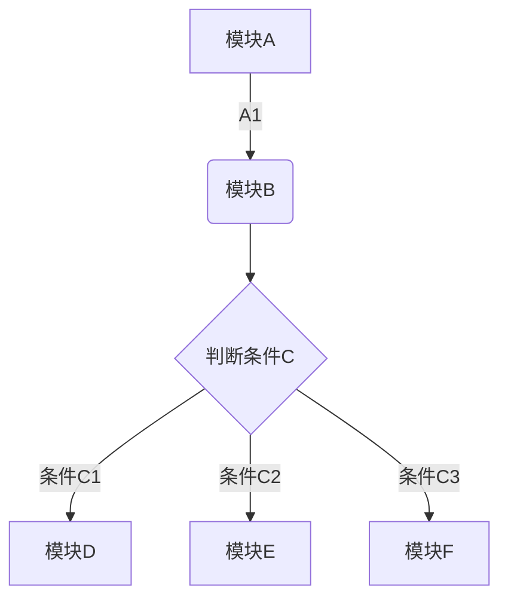
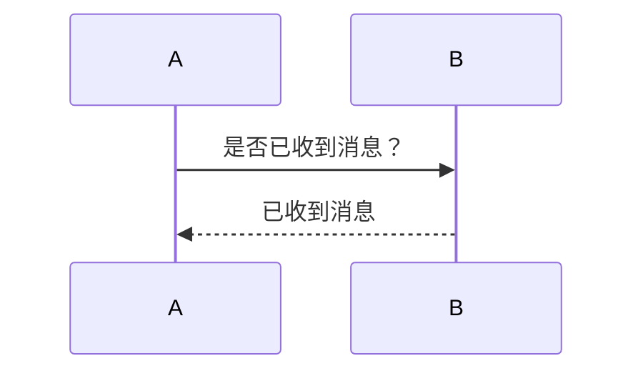
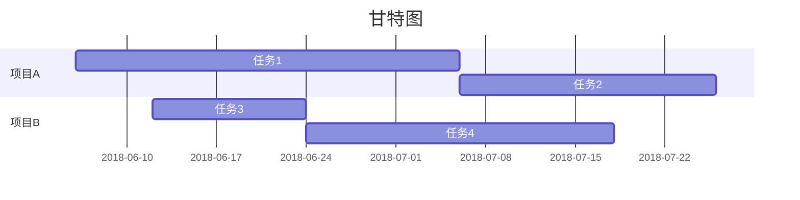

# 流程图模块

流程图模块主流的有3种：

- mermaid模块

  hexo-filter-mermaid-diagrams插件链接：[https://github.com/webappdevelp/hexo-filter-mermaid-diagrams](https://github.com/webappdevelp/hexo-filter-mermaid-diagrams)

- flowchart模块

  hexo-filter-flowchart插件链接：[https://github.com/bubkoo/hexo-filter-flowchart](https://github.com/bubkoo/hexo-filter-flowchart)

- sequence模块

  hexo-filter-sequence插件链接：[https://github.com/bubkoo/hexo-filter-sequence](https://github.com/bubkoo/hexo-filter-sequence)

本文，主要介绍mermaid模块。

# 安装模块

在你的博客根目录下，安装插件

```bash
# npm安装
npm install hexo-filter-mermaid-diagrams
# yarn安装
yarn add hexo-filter-mermaid-diagrams
```

# 配置

在博客根目录下的`_config.yml`文件中添加配置：

```
# mermaid chart
mermaid: ## mermaid url https://github.com/knsv/mermaid
  enable: true  # default true
  version: "7.1.2" # default v7.1.2
  options:  # find more api options from https://github.com/knsv/mermaid/blob/master/src/mermaidAPI.js
    #startOnload: true  // default true
```

如果你编辑的是类图，需要设置：（未验证）

```
external_link: false
```

然后在博客主题中的`layout`文件夹中找到设置`footer`内容的地方。

如果是`pug`文件，则加入代码：

```javascript
if theme.mermaid.enable == true
  script(type='text/javascript', id='maid-script' mermaidoptioins=theme.mermaid.options src='https://unpkg.com/mermaid@'+ theme.mermaid.version + '/dist/mermaid.min.js' + '?v=' + theme.version)
  script.
    if (window.mermaid) {
      var options = JSON.parse(document.getElementById('maid-script').getAttribute('mermaidoptioins'));
      mermaid.initialize(options);
    }
```

如果是`ejs`文件：

```
<% if (theme.mermaid.enable) { %>
  <script src='https://unpkg.com/mermaid@<%= theme.mermaid.version %>/dist/mermaid.min.js'></script>
  <script>
    if (window.mermaid) {
      mermaid.initialize({theme: 'forest'});
    }
  </script>
<% } %>
```

如果是`swig`文件：

```

  <script src='https://unpkg.com/mermaid@{{ theme.mermaid.version }}/dist/mermaid.min.js'></script>
  <script>
    if (window.mermaid) {
      mermaid.initialize({{ JSON.stringify(theme.mermaid.options) }});
    }
  </script>

```

详情可看，hexo-filter-mermaid-diagrams插件链接：[https://github.com/webappdevelp/hexo-filter-mermaid-diagrams](https://github.com/webappdevelp/hexo-filter-mermaid-diagrams)

# 使用

需要在` ``` `后添加类型`mermaid`，然后再写流程图内容，类似于markdown写代码的形式。

- 流程图

```
graph TD#方向：TD上到下，LR左到右，RL右道左
A[模块A] -->|A1| B(模块B)
B --> C{判断条件C}
C -->|条件C1| D[模块D]
C -->|条件C2| E[模块E]
C -->|条件C3| F[模块F]
```




- 时序图

```
sequenceDiagram
A->>B: 是否已收到消息？
B-->>A: 已收到消息
```



- 甘特图

```
gantt
title 甘特图
dateFormat  YYYY-MM-DD
section 项目A
任务1      :a1, 2018-06-06, 30d
任务2      :after a1  , 20d
section 项目B
任务3      :2018-06-12  , 12d
任务4      : 24d
```



感觉能用markdown画流程图真的是太神奇了。

# 参考链接

[为Hexo添加流程图支持](https://leaguecn.github.io/2019/03/01/flow-chart-support/)


---

写文不易，如需转载，请注明出处。

注意文章编写时间，一切以官方文档为主。

如果某处写的有问题，欢迎发邮件，一起交流讨论，共同进步。