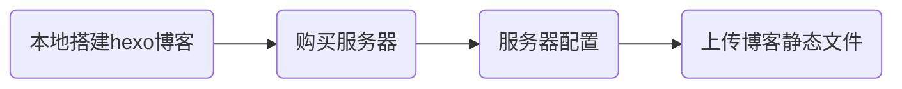

（注意写文时间，以官方文档为主）

这次618在腾讯云买了个95/年的服务器，又重新搭起了我的小破站，简单记录一下。

我的环境配置：

- 服务器：1核2G，1M带宽，腾讯云服务器，Ubuntu系统
- nginx/1.14.0 (Ubuntu)(服务器)
- git/2.17.1(服务器)
- hexo/4.2.1（本地）
- node/12.6.3（本地）

基本流程：




# 本地搭建Hexo博客

Hexo官方文档已经讲得非常详细了。[传送门:Hexo](https://hexo.io/zh-cn/docs/)

本博客目前使用的**theme**是[Paper](https://github.com/random-yang/paper)。

作者的博客示例：[Paper-Demo](https://randomyang.top/)

# 购买服务器

这部分内容，我其实也是个小白，但建议服务器用Linux系统镜像，个人感觉Window Server图形化界面远程链接起来有点卡。博客刚开始没什么流量的话，就弄个1核1G、1M带宽即可，当然土豪随意。

拥有服务器后，我是用xshell这个软件连接的。

具体细节，我就不细说了，主要说服务器配置和本地如何将静态文件上传到服务器。

# 服务器配置

目标：

1. 将`Hexo`博客部署在服务器自建Git仓库
2. 该Git仓库只有特定用户、通过git-shell方式才可访问
3. 配置`Nginx`，使远程可以访问博客文件
4. 配置向仓库提交代码后自动更新博客文件目录的钩子

**建议全程使用最高权限，创建或配置。**

## 安装Git和Nginx

```bash
sudo apt-get update
sudo apt-get install git nginx -y
```

## 创建git用户

创建一个git用户，用于专门远程运行git 服务。

```bash
sudo adduser git
```

## 创建证书登录

收集所有需要登录的用户的公钥，就是本地的`id_rsa.pub`文件，把所有公钥导入到`/home/git/.ssh/authorized_keys`文件里，一行一个。

```bash
sudo vim /home/git/.ssh/authorized_keys
```

（修改方式多种，我这里用vim）

如何查看本机的公钥。[传送门：查看本机ssh公钥，生成公钥](https://blog.csdn.net/shog808/article/details/76563136)

## 创建Git仓库+设置权限

在`/var/repo/`下创建名为`hexo_static`的裸仓库，并设置权限。（名字和位置都可自定义，代码“#”后的内容均是注释解释，不需要复制）

```bash
sudo mkdir /var/repo/                 # 创建文件夹
sudo chown -R git:git /var/repo/      # 设置这个文件夹，用户权限，只有git用户可操作
sudo chmod -R 755 /var/repo/          # 设置这个文件用户可操作权限，-R的意思是这个文件以下的所有文件执行同样操作
cd /var/repo/                         # 进入该文件夹
git init --bare hexo_static.git       # 创建一个名为hexo_static的裸仓库
sudo chown -R git:git hexo_static.git # 设置这个裸仓库只有git用户才可操作权限
```

## 禁用shell登录

出于安全考虑，第二步创建的git用户不允许登录shell，这可以通过编辑`/etc/passwd`文件完成。

```bash
sudo vim /etc/passwd
```

找到类似下面的一行：

```bash
git:x:1001:1001:,,,:/home/git:/bin/bash
```

改为：

```bash
git:x:1001:1001:,,,:/home/git:/usr/bin/git-shell
```

这样，`git`用户可以正常通过ssh使用git，但无法登录shell，因为`git`用户指定的`git-shell`每次一登录就自动退出。

## 配置Nginx托管文件目录

创建`/var/www/hexo`目录，用于Nginx托管，修改目录所有权和权限。（名字和位置都可自定义）

```bash
sudo mkdir -p /var/www/hexo

sudo chown -R git:git /var/www/hexo
sudo chmod -R 755 /var/www/hexo
```

随后修改Nginx的`default`设置，使`root`指向`hexo`目录。

```bash
sudo vim /etc/nginx/sites-available/default
```

修改对应项（不确定或不知道怎么修改的，再google查一下nginx配置文件），默认端口80，输入服务器公网IP即可访问你对应的文件夹了。但如果是别的端口，就还需要另外写一个server{}。

**注意让你的服务器打开此端口。**

```bash
...
server {
        listen 80 default_server;
        listen [::]:80 default_server;

        root /var/www/hexo;
        index index.html index.htm;
...
```

重启Nginx服务

```bash
sudo service nginx restart
```

## 创建Git钩子

在你新建的git裸仓库的文件下的hooks目录下，新建钩子。**注意该文件创建后，记得保持git用户权限。**

```bash
sudo vim /var/repo/hexo_static.git/hooks/post-receive
```

在该文件中添加两行代码，指定 Git 的工作树（源代码）和 Git 目录（配置文件等）。

```bash
#!/bin/bash

git --work-tree=/var/www/hexo --git-dir=/var/repo/hexo_static.git checkout -f
```

保存并退出文件，并让该文件变为可执行文件。

```bash
chmod +x /var/repo/hexo_static.git/hooks/post-receive
```

# 本地博客配置部署

编辑本地博客根目录下的`config.yml`文件

```
deploy:
  type: git
   repo: git@server_ip:/var/repo/hexo_static.git
  branch: master
```

记得安装对应hexo部署插件

```
npm install hexo-deployer-git --save
```

最后在博客根目录下，git bash中运行，如下代码，生成静态文件，并上传部署。

```bash
hexo g && hexo d
```

# 完成

部署完成后，在浏览器里输入你服务器公网IP加端口号，即可访问你的博客了。(如果是默认端口号，则只要输入公网IP即可)

```
xxx.xxx.xxx.xxx:8080
```


# 参考链接

[简书--在 Ubuntu 服务器部署 hexo 搭建个人博客](https://www.jianshu.com/p/271a1649a853)

[简书--用Hexo部署博客到Ubuntu服务器](https://www.jianshu.com/p/16b89f4f7136)

[廖雪峰--搭建Git服务器](https://www.liaoxuefeng.com/wiki/896043488029600/899998870925664)

---

写文不易，如需转载，请注明出处。

如果某处写的有问题，欢迎留言，一起交流讨论，共同进步。


